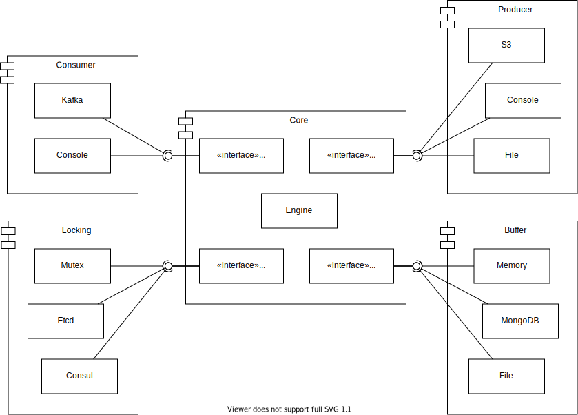

# go-logs-archiver

A tool to consume json-based messages from a data source, sort and send them to a persistant storage.

## Architecture



## Building

```bash
# Let's show the available targets
$ make help
all                  Create the program
c.out                Create the coverage file
clean                Clean the created artifacts
coverage             Show the coverage ratio per function
coverage-code        Show the covered code in a browser
get                  Download required modules
help                 This help message
test                 Run go test
$

# Let's compile
$ make all
go test ./...
?       go-logs-archiver        [no test files]
?       go-logs-archiver/cmd    [no test files]
?       go-logs-archiver/internal/buffer        [no test files]
?       go-logs-archiver/internal/consumer      [no test files]
ok      go-logs-archiver/internal/core  (cached)
?       go-logs-archiver/internal/core/domain   [no test files]
?       go-logs-archiver/internal/core/ports    [no test files]
?       go-logs-archiver/internal/lock  [no test files]
?       go-logs-archiver/internal/producer      [no test files]
go build -o go-logs-archiver main.go
$
```

## Usage

```bash
$ ./go-logs-archiver --help
Reads the incoming messages from the configured consumer driver
and send them to the backend.

For example: get messages from a kafka topic and send them to a S3 storage.

Usage:
  go-logs-archiver [command]

Available Commands:
  completion  Generate the autocompletion script for the specified shell
  flush       Flush the configured buffer into the persistent storage
  help        Help about any command
  run         Start processing
  validate    Validate the given configuration

Flags:
      --config string      config file (default is $HOME/.go-logs-archiver.yaml)
  -h, --help               help for go-logs-archiver
  -l, --log-level string   Level of verbosity (development, production).
  -t, --toggle             Help message for toggle

Use "go-logs-archiver [command] --help" for more information about a command.
```
